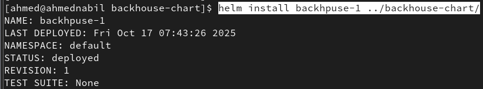
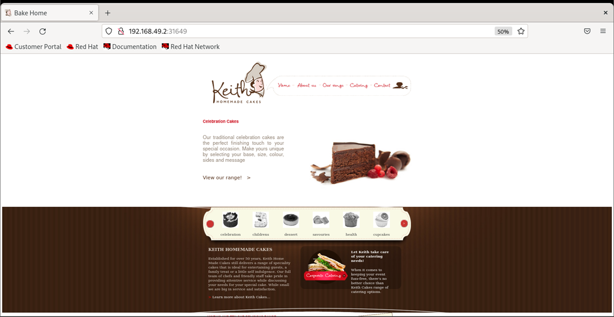

# Helm App

Build and Push Docker Image
```bash
docker build -t bakehouse-img -f Dockerfile .
docker image ls
echo "dockerHubPass" | docker login -u ahmednabil20 --password-stdin
docker tag bakehouse-img:latest ahmednabil20/bakehouse-img:latest
docker push ahmednabil20/bakehouse-img:latest
```

## Create helm chart
```bash
helm create bakehouse-chart
```

## Install the Helm release
```bash
helm install bakehouse-release ./bakehouse-chart
```


## Access the Application

